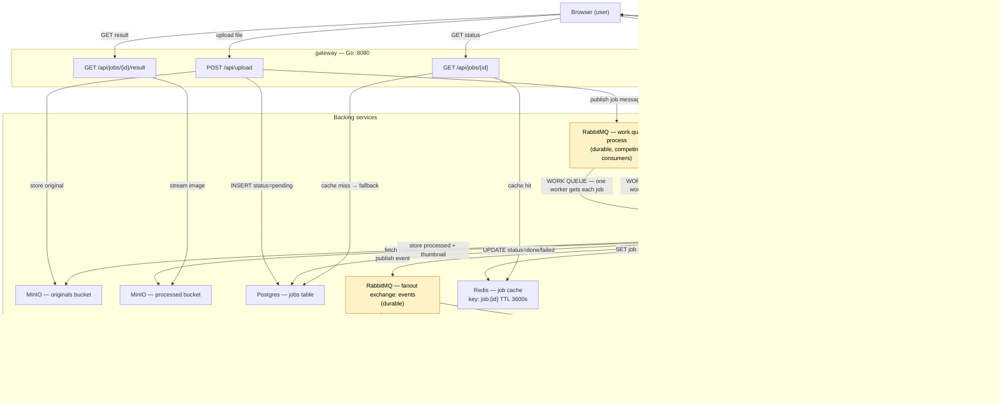

# AGENTS.md — media-pipeline

Monorepo, polyglot microservices image pipeline. **App only** — no k8s/compose here.

## Layout
- `services/{migrator,gateway,worker,notifier,web}` — one service each, self-contained.
- `docs/contracts.md` — THE cross-service contract. Read before touching any service.
- `libs/contracts/contracts.json` — machine-readable name constants.

## Pipeline flowchart

> **Legend:**
> - **Work queue** (`process`): durable queue shared by all worker replicas — only **one** worker processes each job. Scale workers on queue depth (HPA / KEDA).
> - **Fanout exchange** (`events`): each notifier replica binds its own exclusive, auto-delete queue — **every** replica receives every event, so all connected browsers get live updates regardless of which notifier they hit.

## Invariants (do not break without updating docs/contracts.md AND every service)
- Queue `process` (durable), fanout exchange `events`, buckets `originals`/`processed`,
  Redis `job:{id}` TTL 3600. Message shapes per docs/contracts.md.
- All config via env (docs/env-reference.md). `/healthz` + `/readyz` on every service. SIGTERM-graceful.

## Working in one service
Each service builds/tests independently; you do NOT need other services' source — only the contract.
Integration tests use testcontainers (need a Docker daemon). Run a service's tests from its own dir.

## Conventions
Multi-stage non-root Dockerfiles. Structured stdout logs. TDD: failing test → minimal code → pass → commit.
