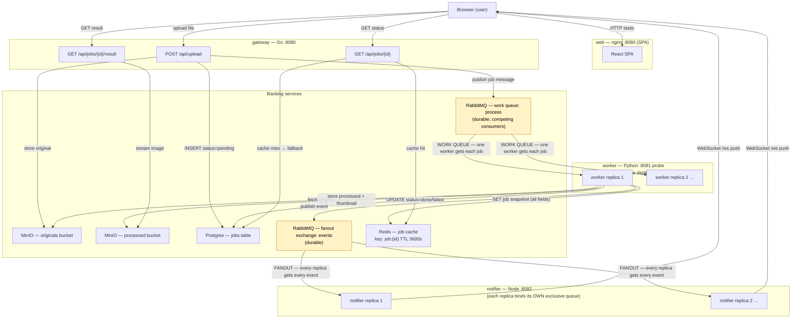

# media-pipeline

Async image-processing pipeline — a learning project for Kubernetes concepts.
Upload an image; it gets resized, thumbnailed, watermarked, and stored in object storage.
Results stream back to the browser in real time via WebSocket.

App-only monorepo: five services. **No Kubernetes manifests are included** — deploying to a
cluster is the learning exercise. A [`docker-compose.yml`](docker-compose.yml) is provided
**purely as a local reference** (see below); the real target is k8s.
See [`docs/contracts.md`](docs/contracts.md) for the cross-service API contract and
[`docs/env-reference.md`](docs/env-reference.md) for every environment variable.

## Run it locally (reference)

```bash
docker compose up --build            # then open http://localhost:8080
docker compose up -d --scale worker=4 # competing consumers — watch the queue drain
```

- RabbitMQ UI: http://localhost:15672 (`app`/`app`) · MinIO UI: http://localhost:9001 (`minioadmin`/`minioadmin`)
- The compose **`edge`** service emulates your k8s Ingress (routes `/`→web, `/api`→gateway,
  `/ws`→notifier) — see [`deploy/edge.nginx.conf`](deploy/edge.nginx.conf) for exactly the
  routing/rewrite your real Ingress must do.
- The `migrator` runs to completion (your k8s Job/initContainer) before the app services start.
- Behind a TLS-intercepting proxy, build the worker with `UV_INSECURE_HOST="pypi.org files.pythonhosted.org" docker compose build worker`.

---

## Architecture

```
Browser
  │
  │  HTTP /api/*   WebSocket /ws
  ▼                     ▼
┌─────────┐       ┌──────────┐
│ gateway │       │ notifier │
│ (Go)    │       │ (Node)   │
└────┬────┘       └────┬─────┘
     │ RabbitMQ        │ RabbitMQ
     │ (process queue) │ (events fanout)
     ▼                 ▲
┌──────────┐      ┌──────────┐
│  worker  │──────│  worker  │  (competing consumers)
│ (Python) │      │ (Python) │
└────┬─────┘      └──────────┘
     │
     ├── Postgres  (job state)
     ├── Redis     (job cache, TTL 3600s)
     └── MinIO     (originals / processed buckets)

                 ┌────────────────┐
  Browser ──────▶│  web (nginx)   │  /  → static SPA
                 └────────────────┘

Ingress routing:
  /        → web:8080
  /api/... → gateway:8080  (prefix stripped)
  /ws      → notifier:8082 (WebSocket upgrade)
```

**Backing services (you deploy them):** RabbitMQ, Redis, Postgres, MinIO

### Pipeline flowchart



> **Legend:**
> - **Work queue** (`process`): durable queue shared by all worker replicas — only **one** worker processes each job. Scale workers on queue depth (HPA / KEDA).
> - **Fanout exchange** (`events`): each notifier replica binds its own exclusive, auto-delete queue — **every** replica receives every event, so all connected browsers get live updates regardless of which notifier they hit.

---

## Services

| Service   | Language   | Role                                         | Default port | Scale pattern           |
|-----------|------------|----------------------------------------------|:------------:|-------------------------|
| migrator  | Go         | One-shot DB schema migration (Job / initContainer) | —      | Run-to-completion       |
| gateway   | Go         | Upload, list/status/result API               | 8080         | Stateless Deployment    |
| worker    | Python     | Image processing (resize, thumbnail, watermark) | 8081 (probe) | HPA / KEDA on `process` queue depth |
| notifier  | TypeScript | WebSocket fan-out of job events              | 8082         | Stateless Deployment    |
| web       | TypeScript | SPA (React + Vite) served by nginx           | 8080         | Stateless Deployment    |

---

## Build all images

```bash
for s in migrator gateway worker notifier web; do
  docker build -t media-pipeline/$s ./services/$s
done
```

---

## Kubernetes concepts checklist

These concepts are exercised or required when deploying this pipeline:

- **Deployments / replicas** — gateway, worker, notifier, web each run as a Deployment; set `replicas` for horizontal scale.
- **StatefulSets + PVC** — Postgres and MinIO need stable storage; use StatefulSets with PersistentVolumeClaims.
- **Services: ClusterIP vs exposed** — gateway, notifier, and web get Services; only web (or an Ingress) is exposed externally. Postgres/Redis/RabbitMQ/MinIO use ClusterIP-only Services.
- **Ingress path routing + WebSocket** — a single Ingress routes `/` → web, `/api/` → gateway (path strip), `/ws` → notifier with WebSocket upgrade annotation.
- **ConfigMaps / Secrets** — non-sensitive config (bucket names, ports) in a ConfigMap; credentials (`DATABASE_URL`, `RABBITMQ_URL`, S3 keys, etc.) in Secrets.
- **Liveness / readiness probes** — all app services expose `/healthz` (liveness) and `/readyz` (readiness) HTTP endpoints.
- **HPA / KEDA on queue depth** — worker autoscales based on RabbitMQ `process` queue depth; KEDA's RabbitMQ scaler or a custom HPA metric.
- **Resource limits** — set `requests` and `limits` on all containers; worker is CPU/memory-intensive during image processing.
- **Graceful shutdown** — all services handle `SIGTERM`; `SHUTDOWN_TIMEOUT_SECONDS` (default 25) controls drain time.
- **Migrator as Job / initContainer** — run the migrator once as a Kubernetes Job, or as an initContainer on the gateway Deployment, before app services start.
- **NetworkPolicies (optional)** — restrict pod-to-pod traffic: only gateway/worker may reach Postgres; only worker may write to MinIO processed bucket; notifier only needs RabbitMQ.

---

## Further reading

- [`docs/contracts.md`](docs/contracts.md) — message shapes, HTTP API, WebSocket protocol, Postgres schema, Redis key format, Ingress routing.
- [`docs/env-reference.md`](docs/env-reference.md) — every environment variable for every service.
- [`docs/smoke-test.md`](docs/smoke-test.md) — ordered in-cluster smoke-test checklist.
- Each service has its own `README.md` and `AGENTS.md` under `services/<name>/`.
